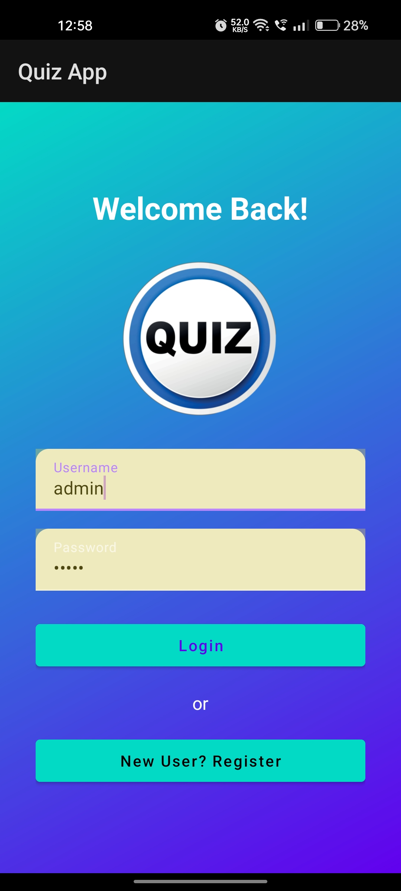
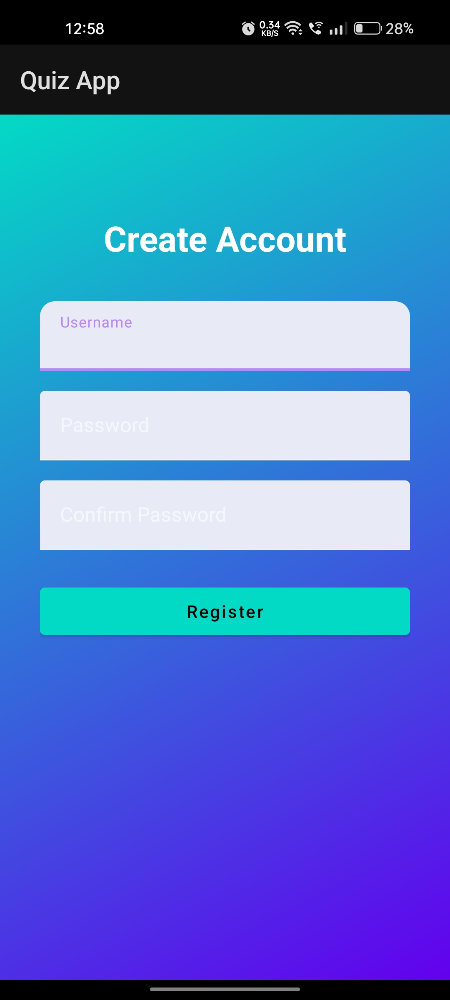
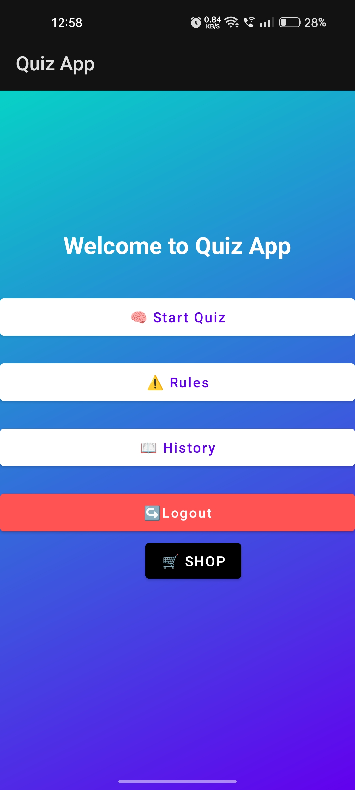
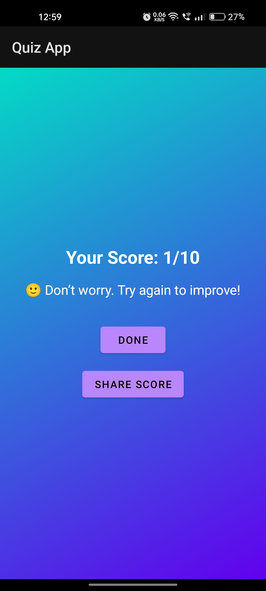
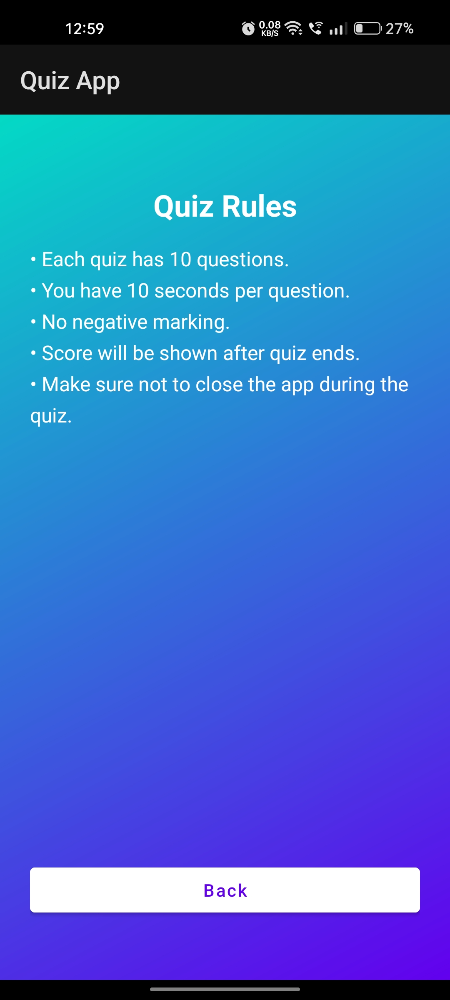
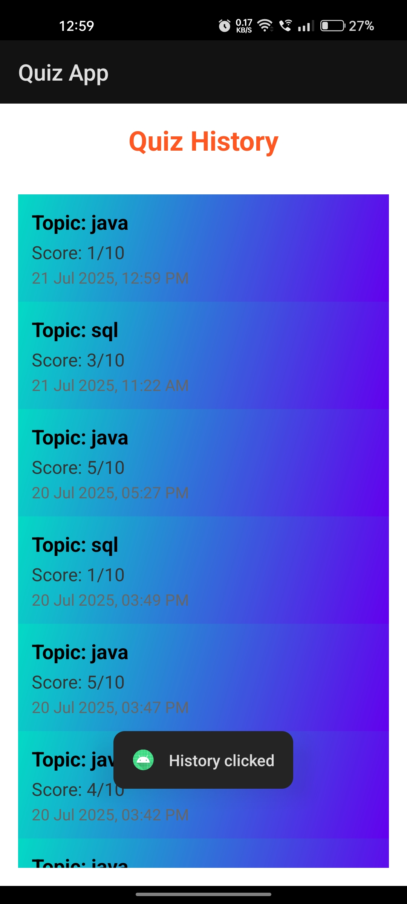
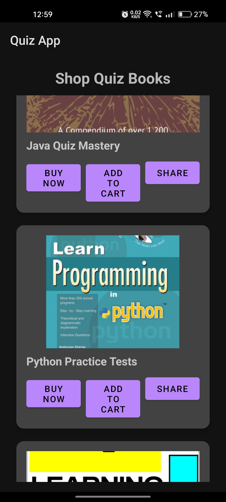

# Android-Quiz-App
An  Android quiz app with timed MCQs, result tracking, and integrated bookstore.
# 📱 Android Quiz App

A fully functional Android quiz app with features like:
- Topic selection (Java, Python, SQL, etc.)
- Timed multiple-choice questions
- Scoring system with result screen
- Quiz attempt history with date/time
- Book store section with buy/share options

## 🚀 Features
- 💡 10-second timer per question
- 📊 Score summary and motivational feedback
- 📚 Quiz books with buy/share options
- 🕘 Quiz history saved with SharedPreferences
- 📤 Share results with friends

## 📷 Screenshots

  
  
  
  
   
  
  
  
  

## 🛠 Tech Stack
- Java
- Android SDK
- JSON (for questions)
- SharedPreferences (for history)
- RecyclerView (for book list)

- ## 📂 Folder Structure
MainActivity
QuizActivity
ResultActivity
HistoryActivity
BookStoreActivity
JSON assets (java.json, python.json, sql.json)

## 📎 GitHub Link
[🔗 View the Repository](https://github.com/rithish-r-18/Android-Quiz-App)

## 🧑‍💻 Author
**Rithish R** — [GitHub Profile](https://github.com/rithish-r-18)
